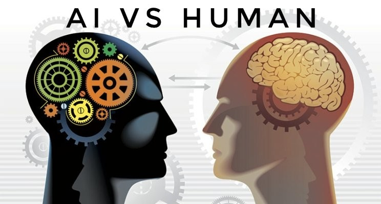

# DIGHUM-101-Individual-Project

<h1 align="center">
    Title: Can AI appreciate books like humans?
<h1/>

  

    
## Abstarct:

&nbsp;&nbsp;&nbsp;&nbsp;AI has made tremendous progress so far, and it is now believed that it may gradually surpass human cognition. However, can such powerful AIs surpass humans in semantic aspects other than the point of computation? To find an intuitive answer about this question, I decided to look at the book reports written by humans and the book reports written by AI. 
&nbsp;&nbsp;&nbsp;&nbsp;The book used in the experiment was Anna Karenina, and human's book reports were collected from several blogs. Two AI models, GPT-3 and BERT, were adopted for the experiment. GPT-3 was used to generate the book reports, and BERT was used to summarize the book reports. 
&nbsp;&nbsp;&nbsp;&nbsp;The methods used for comparative analysis were:
* Based on the frequency of words mainly used by humans and GPT-3, I estimated which word each focused on.
* The range of thinking diversity on one topic was estimated by comparing the diversity of words used by people with the diversity of words used by GPT-3.
* It was investigated whether the book reports generated by GPT-3 and the summary generated by BERT could be understood from a human point of view.

&nbsp;&nbsp;&nbsp;&nbsp;Before the experiment, I was deduced that the powerful AI models trained based on massive amounts of data would show the book report writing ability that surpasses humans' ability. Furthermore I also thought that the models could be much more effective and faster than humans to create summaries for text. The models' computational power have surpassed human computational power long ago, and I've believed that calculations could yield any intended value.

